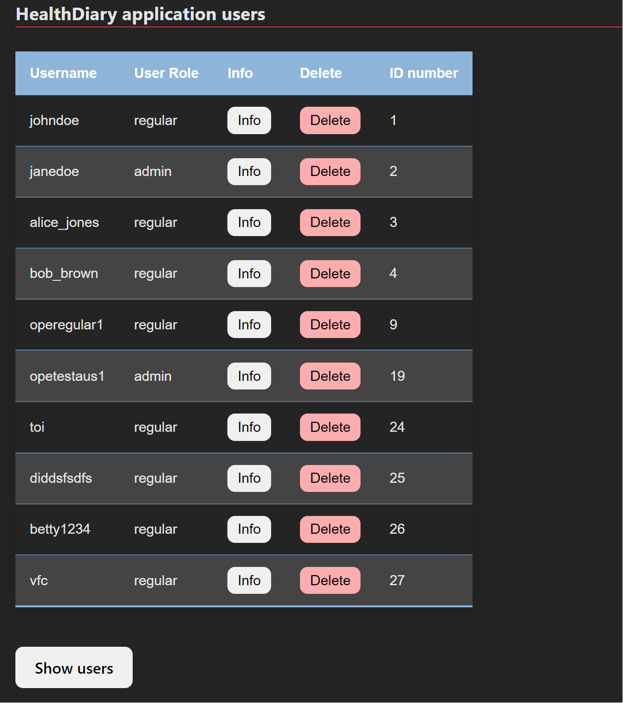
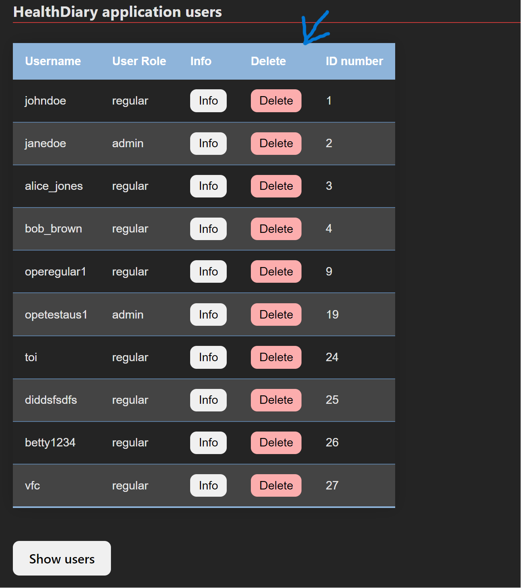
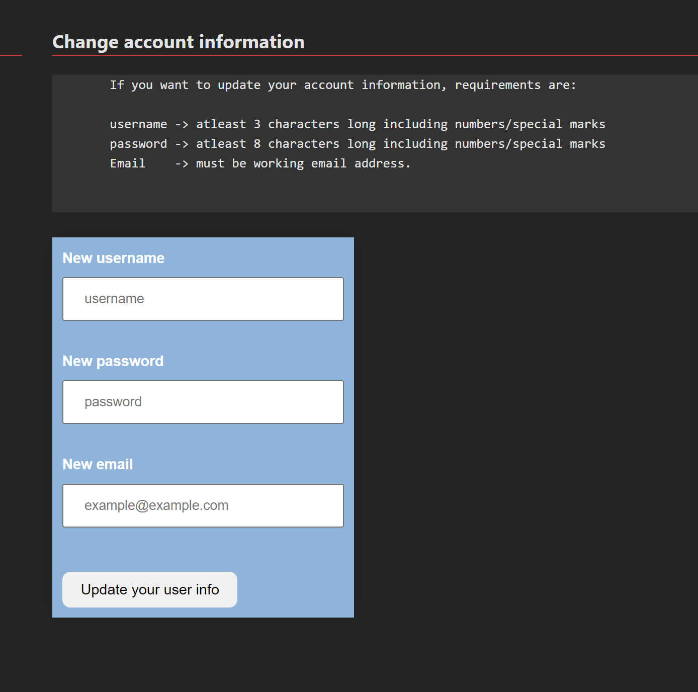
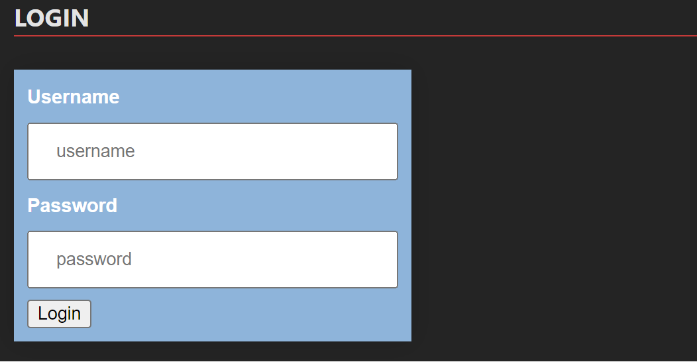
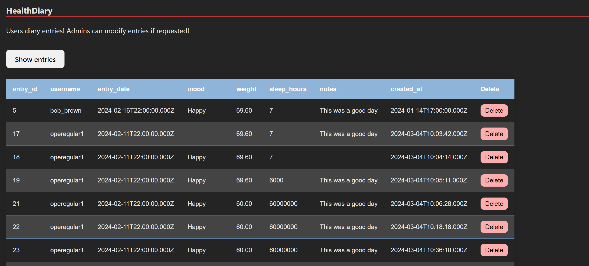
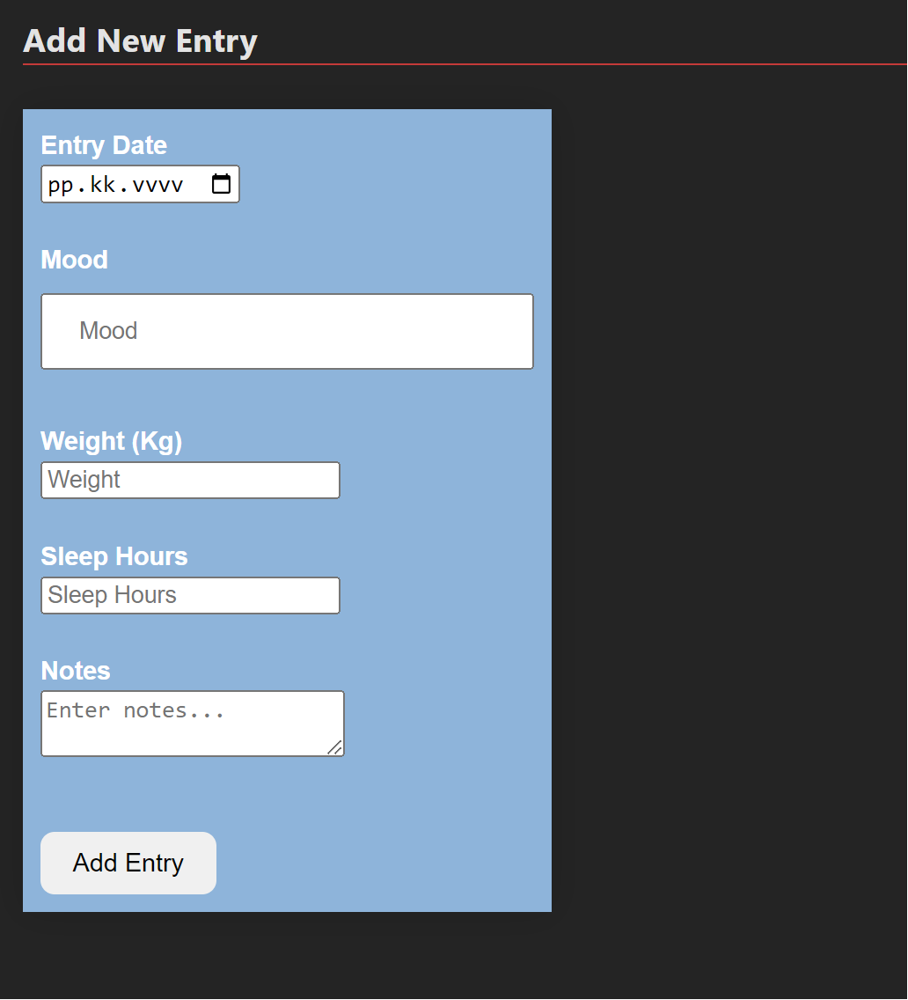
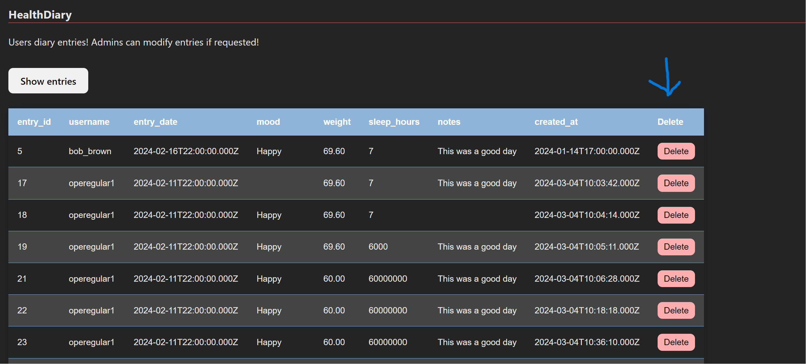
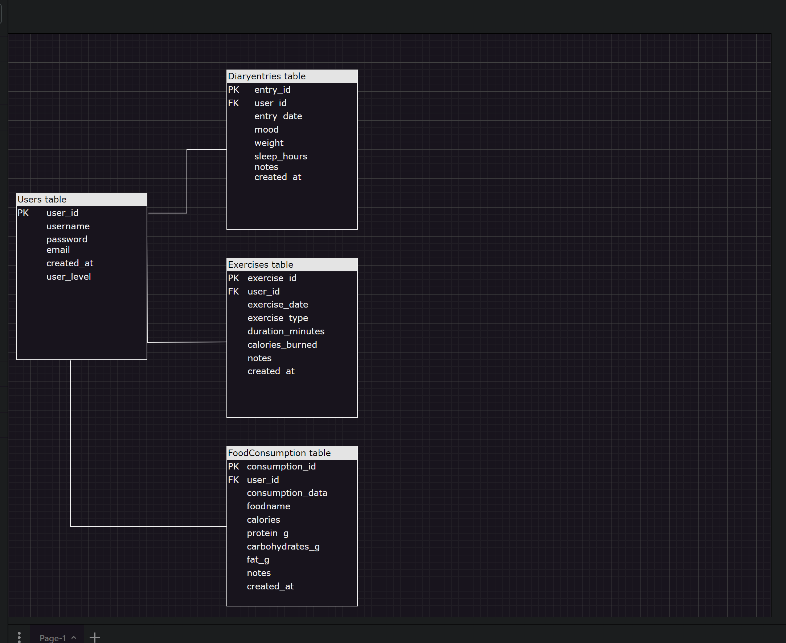

# Prequisites
node.js + Express
# Start
start dev server: 'npm run dev'

# Link to API documentation

# Link to the application

# Get all users (requires token)

GET http://127.0.0.1:3000/users

# Delete user (requires token)

In the UI its been modified that admin can delete any user and regular user can only affect only in own userdata. First user must delete their own entries before user deletion.

DELETE http://127.0.0.1:3000/users/:id

# Create user

POST http://127.0.0.1:3000/users
content-type: application/json

{
  "username": "test-update4",
  "password": "test-pw-update4",
  "email": "update4@example.com"
}

# Update user's own data (requires token)

user can see the updates in user data in the user list immediately when user refreshes the list.

PUT http://127.0.0.1:3000/users/
content-type: application/json

{
  "username": "test-update4",
  "password": "test-pw-update4",
  "email": "update4@example.com"
}

# Login

POST http://localhost:3000/api/users/login
content-type: application/json

{
  "username": "user",
  "password": "secret"
}

# Logout

UI has a functioning logout, After user clicks the logout, The localstorage empties itself with the gathered data so relogin is required to get back in.

# Get all entries(requires token)

Modified in the UI that user that is logged in can see only their own entries,
User that is admin can see everyones entries and delete them also.

GET http://localhost:3000/api/entries/:id
GET http://localhost:3000/api/auth/entries

# Post entry (requires token)

Idecided to get rid off the update entry (PUT), The deletion is so quick and easy so user can delete old entry and just do it again.

POST http://localhost:3000/api/entries
content-type: application/json

{
  "entry_date": "2024-02-12",
  "mood": "Happy",
  "weight": 69.6,
  "sleep_hours": 7,
  "notes": "This was a good day"

}

# Delete entry ( requires token)

user can delete own entries and have to delete them if they want to delete their user from the application.
Admin can do that also.

DELETE http://localhost:3000/api/entries/:id

# Database architecture
At this stage this application is using only 2 of the 4 tables (users, diaryentries)

# Known bugs / problems
After user deletes its account, user must logout to finalize the deletion. 

# Contributors

with support and teaching from course teachers: Matti Peltoniemi and Ulla Sederlöf at Metropolia UAS.
